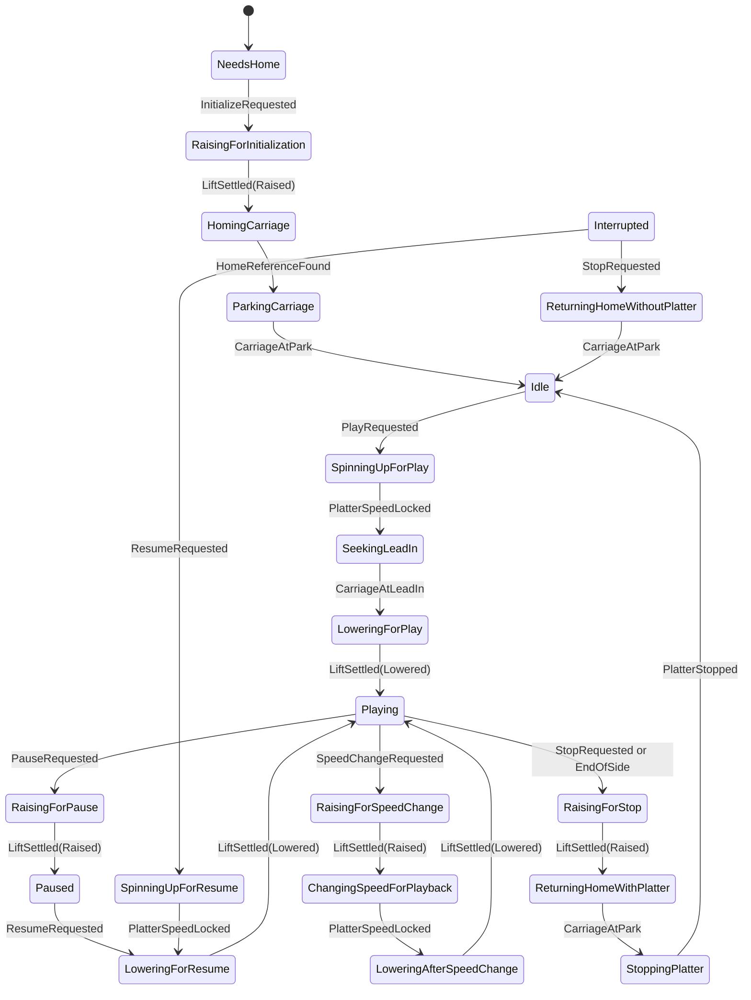

# Turntable state machine and ScreenKey behavior

Status: **approved design baseline**. The system behavior, hardware boundaries, diagnostic control
authority, and initial three-ScreenKey interaction model are settled.

## 1. Purpose

The turntable controller coordinates the platter, tonearm carriage, tonearm lift, user interface,
and eventually CAN commands. It does not perform motor commutation, render screens, or directly
poll GPIO. Those responsibilities remain in their subsystem drivers.

The design favors explicit, auditable workflow states over combinations of booleans. It must remain
straightforward to extend without changing existing subsystem implementations or teaching the HMI
about hardware details.

## 2. Architectural boundaries

```text
ScreenKeys / CAN
      |
      v
ApplicationController --------> immutable Snapshot -----> HMI / CAN status
      |
      +---- Normal authority ----> TurntableController
      |
      +---- Diagnostic authority -> DiagnosticController
                                          |
                    +---------------------+---------------------+
                    |                     |                     |
                IPlatter        ITonearmCarriage        ITonearmLift
```

- `TurntableController` owns the product-level state and is the only component allowed to initiate
  product state transitions while normal authority is active.
- `ApplicationController` owns control authority. It routes actuator commands from exactly one of
  `TurntableController` or `DiagnosticController`; both can never command hardware concurrently.
- `DiagnosticController` provides explicit, bounded lower-level tests without adding diagnostic
  exceptions to normal product transitions. Section 10 defines its authority and safety boundary.
- `IPlatter` owns platter drive modes, speed estimation, speed lock, and platter faults. The existing
  `foc::Mode` remains private motor-control state rather than becoming product state.
- `ITonearmCarriage` owns carriage motion, breakbeam homing, unwrapped position, software limits,
  servo-follow, and carriage faults.
- `ITonearmLift` owns raising and lowering the tonearm.
- The initial lift implementation uses RC PWM. The linear servo is calibrated and homed outside the
  turntable, so this system never homes it. Completion is estimated from configured travel time.
- UI navigation is independent of operational state. Opening Settings never changes the physical
  turntable state by itself.
- Physical keys and CAN commands are translated into the same semantic events.

Concrete subsystem objects may be statically allocated and passed to the controller by reference.
The interfaces do not require dynamic allocation.

```cpp
enum class ControlAuthority : uint8_t {
    Normal,
    Diagnostic,
};
```

`ControlAuthority` is not a turntable product state. Changing it is an application-level handoff
with explicit safe entry and exit sequences.

## 3. Persistent and session data

The controller owns or exposes the following strongly typed data independently of its workflow
state:

```cpp
enum class RecordSpeed : uint8_t { Rpm33, Rpm45 };
enum class HomeConfidence : uint8_t { Unknown, Valid };
enum class PositionConfidence : uint8_t { Unknown, Estimated, Verified };
```

- `selected_speed`: defaults according to stored user settings and may be changed without creating
  separate 33 and 45 RPM workflow states.
- `home_confidence`: always `Unknown` at turntable power-up. It becomes `Valid` only after the
  carriage breakbeam homing sequence succeeds.
- `carriage_position`: zero is the outward breakbeam trip point; positive travel is inward toward
  the record center. The parked position is a small positive offset so the beam is clear.
- `active_fault`: a structured fault record containing code, source, recovery policy, timestamp,
  and whether the fault invalidated carriage home.
- `operation_id`: increments whenever a subsystem command is issued. Completion events carry the
  corresponding ID so late events from cancelled operations cannot advance a newer workflow.

The selected speed and user settings may be persistent. Carriage home validity is session-only and
is never restored after turntable power-up.

## 4. Product states

The product state is intentionally explicit. Transient states name the physical operation being
waited on, making traces and fault reports understandable without reconstructing hidden flags.

| State | Meaning and invariant |
|---|---|
| `NeedsHome` | Carriage coordinates are not trusted. Platter is stopped and Play is unavailable. |
| `RaisingForInitialization` | User requested initialization; raised PWM was commanded and its conservative settling interval is running. |
| `HomingCarriage` | Carriage is moving outward slowly, looking for the breakbeam reference. |
| `ParkingCarriage` | Reference was established and the carriage is moving inward to the beam-clear parked position. |
| `Idle` | Home is valid, carriage is parked, tonearm is raised, and platter is stopped. |
| `SpinningUpForPlay` | Platter is accelerating to the selected speed for a new side. |
| `SeekingLeadIn` | Platter is locked; raised tonearm is moving to the fixed 12-inch lead-in position. |
| `LoweringForPlay` | Tonearm lower PWM was commanded; settling interval is running. |
| `Playing` | Platter is locked, tonearm is lowered, and carriage servo-follow is active. |
| `RaisingForPause` | Tonearm raise PWM was commanded while platter and carriage position are retained. |
| `Paused` | Tonearm is raised, platter continues at locked speed, and carriage holds its position. |
| `LoweringForResume` | Tonearm is being lowered at its retained carriage position. |
| `RaisingForSpeedChange` | Tonearm is being raised before a live speed change. |
| `ChangingSpeedForPlayback` | Tonearm is raised; platter is acquiring the newly selected speed before playback resumes. |
| `LoweringAfterSpeedChange` | New speed is locked and the tonearm is returning to the record. |
| `ChangingSpeedWhilePaused` | Paused tonearm remains raised while the platter acquires the new speed. |
| `RaisingForStop` | Tonearm is being raised before carriage return. |
| `ReturningHomeWithPlatter` | Raised tonearm is returning outward while the platter remains running. |
| `StoppingPlatter` | Carriage is parked and the platter is stopping. |
| `Interrupted` | Recoverable fault was cleared; home and carriage position remain valid, tonearm is raised, and platter is stopped. |
| `SpinningUpForResume` | Platter is acquiring speed before resuming from `Interrupted` at the retained position. |
| `ReturningHomeWithoutPlatter` | Raised tonearm is returning from `Interrupted`; platter is already stopped. |
| `Maintenance` | An exclusive, explicitly selected hardware procedure owns the relevant subsystems. |
| `Fault` | A latched fault is displayed and safe-state commands have been issued. |

Diagnostic mode is deliberately absent from this table. The normal product controller is suspended
while `DiagnosticController` owns the same subsystem interfaces; it is not weakened with bypass
transitions.

### Nominal flow



## 5. Events

### User and remote intents

| Event | Payload | Notes |
|---|---|---|
| `InitializeRequested` | none | Valid only from `NeedsHome`. |
| `CancelRequested` | none | Cancels initialization or a cancellable maintenance operation. |
| `PlayRequested` | none | Starts a new side from `Idle`. |
| `PauseRequested` | none | Raises the tonearm but keeps platter speed and carriage position. |
| `ResumeRequested` | none | Resumes from `Paused` or `Interrupted`. |
| `StopRequested` | none | Safely raises, returns, and stops from any active workflow. |
| `SpeedChangeRequested` | `RecordSpeed` | Changes the selected target using state-appropriate behavior. |
| `MaintenanceRequested` | `MaintenanceOperation` | Guarded according to operation requirements. |
| `MaintenanceCancelRequested` | none | Honored only if the active operation declares itself cancellable. |
| `AcknowledgeFaultRequested` | none | Recovery is allowed only after the underlying condition clears. |

Settings navigation events are consumed by the HMI and are not product events unless they commit a
setting or request a maintenance operation.

Application-level diagnostic events are handled outside the normal product transition table:

| Event | Payload | Consumer |
|---|---|---|
| `EnterDiagnosticsRequested` | none | `ApplicationController` starts safe authority handoff. |
| `ExitDiagnosticsRequested` | none | `ApplicationController` starts safe diagnostic shutdown. |
| `DiagnosticCommandRequested` | `DiagnosticCommand` | `DiagnosticController` validates and runs one test. |
| `DiagnosticAbortRequested` | none | `DiagnosticController` safely aborts the active test. |

### Subsystem completions and observations

| Event | Payload |
|---|---|
| `LiftSettled` | target position, confidence, operation ID |
| `HomeReferenceFound` | raw carriage position, operation ID |
| `CarriageAtPark` | verified position, operation ID |
| `CarriageAtLeadIn` | verified position, operation ID |
| `PlatterSpeedLocked` | selected and measured speed, operation ID |
| `PlatterStopped` | operation ID |
| `PlatterSpeedLost` | measured speed/error |
| `EndOfSideDetected` | carriage position and detection evidence |
| `MaintenanceCompleted` | operation and result |
| `FaultDetected` | `FaultRecord` |
| `DeadlineExpired` | operation and operation ID |

Subsystem status may be polled, but changes are converted into these events before the controller
handles them. A fixed-capacity event queue prevents heap use and preserves event ordering.

## 6. Transition table

`SettingsOpened` is intentionally absent: Settings is an HMI view, not a physical state transition.
Unlisted events are ignored and traced in debug builds.

### Initialization and idle

| Current state | Event | Guard | Action | Next state |
|---|---|---|---|---|
| `NeedsHome` | `InitializeRequested` | no blocking fault | command lift raised; start conservative settle interval | `RaisingForInitialization` |
| `RaisingForInitialization` | `LiftSettled(Raised)` | matching operation ID | begin low-speed outward homing search | `HomingCarriage` |
| `HomingCarriage` | `HomeReferenceFound` | breakbeam transition valid | stop; establish coordinate zero; command inward park offset | `ParkingCarriage` |
| `ParkingCarriage` | `CarriageAtPark` | beam clear and position within tolerance | set home valid | `Idle` |
| initialization state | `CancelRequested` | always | stop carriage; retain home unknown; command lift raised | `NeedsHome` |
| homing/parking state | `DeadlineExpired` | matching operation ID | raise `CarriageHomeFailed`; invalidate home | `Fault` |
| `Idle` | `PlayRequested` | home valid | start platter at selected speed | `SpinningUpForPlay` |
| `Idle` or `NeedsHome` | `SpeedChangeRequested` | supported speed | store selected speed | unchanged |

The homing search has both a maximum elapsed time and maximum commanded relative travel. Mechanical
hard stops make a failed breakbeam safe at the configured low homing speed/voltage, but failure still
latches a fault.

### Starting and playback

| Current state | Event | Guard | Action | Next state |
|---|---|---|---|---|
| `SpinningUpForPlay` | `PlatterSpeedLocked` | stable for configured lock window | command carriage to 12-inch lead-in | `SeekingLeadIn` |
| `SpinningUpForPlay` | `DeadlineExpired` | matching operation ID | raise `PlatterLockTimeout` | `Fault` |
| `SeekingLeadIn` | `CarriageAtLeadIn` | position within tolerance | command lift lowered | `LoweringForPlay` |
| `SeekingLeadIn` | `DeadlineExpired` | matching operation ID | raise `CarriageSeekTimeout`; invalidate home if slip/stall suspected | `Fault` |
| `LoweringForPlay` | `LiftSettled(Lowered)` | matching operation ID | enable carriage servo-follow | `Playing` |
| `Playing` | `PauseRequested` | none | disable servo-follow; command lift raised | `RaisingForPause` |
| `RaisingForPause` | `LiftSettled(Raised)` | matching operation ID | hold carriage position | `Paused` |
| `Paused` | `ResumeRequested` | platter still locked | command lift lowered | `LoweringForResume` |
| `LoweringForResume` | `LiftSettled(Lowered)` | matching operation ID | enable servo-follow | `Playing` |
| `Playing` | `EndOfSideDetected` | detector confidence satisfied | disable servo-follow; command lift raised | `RaisingForStop` |
| `Playing` | `PlatterSpeedLost` | outside configured tolerance/window | enter safe fault handling | `Fault` |

### Speed selection

| Current state | Event | Action | Next state |
|---|---|---|---|
| `Idle`, `NeedsHome`, or `Interrupted` | `SpeedChangeRequested` | store selected speed | unchanged |
| `Playing` | `SpeedChangeRequested` | store selected speed; disable servo-follow; command lift raised | `RaisingForSpeedChange` |
| `RaisingForSpeedChange` | `LiftSettled(Raised)` | command new platter target | `ChangingSpeedForPlayback` |
| `ChangingSpeedForPlayback` | `PlatterSpeedLocked` | command lift lowered | `LoweringAfterSpeedChange` |
| `LoweringAfterSpeedChange` | `LiftSettled(Lowered)` | enable servo-follow | `Playing` |
| `Paused` | `SpeedChangeRequested` | store selected speed; command new platter target | `ChangingSpeedWhilePaused` |
| `ChangingSpeedWhilePaused` | `PlatterSpeedLocked` | keep lift raised and carriage held | `Paused` |
| any speed-acquisition state | `DeadlineExpired` | raise `PlatterLockTimeout` | `Fault` |

Speed selection is disabled during initialization, lead-in seek, lowering/raising transitions,
return-home, platter stopping, maintenance, and uncleared faults. This prevents partially completed
workflows from being silently retargeted.

### Stop and cancellation

| Current state | `StopRequested` action | Next state |
|---|---|---|
| `SpinningUpForPlay` | request platter stop | `StoppingPlatter` |
| `SeekingLeadIn` | stop carriage; command return while lift is already raised | `ReturningHomeWithPlatter` |
| `LoweringForPlay`, `Playing`, `LoweringForResume`, or `LoweringAfterSpeedChange` | disable servo-follow; command lift raised | `RaisingForStop` |
| `RaisingForPause` or `RaisingForSpeedChange` | retain the in-progress raise but change its completion intent to stop | `RaisingForStop` |
| `Paused`, `SpinningUpForResume`, `ChangingSpeedWhilePaused`, or `ChangingSpeedForPlayback` | command carriage return with lift raised | `ReturningHomeWithPlatter` |
| `RaisingForStop` | no duplicate command | unchanged |
| `ReturningHomeWithPlatter` or `StoppingPlatter` | no duplicate command | unchanged |
| `Interrupted` | command carriage return; platter is already stopped | `ReturningHomeWithoutPlatter` |
| `Idle` or `NeedsHome` | no action | unchanged |

| Current state | Event | Action | Next state |
|---|---|---|---|
| `RaisingForStop` | `LiftSettled(Raised)` | command carriage park | `ReturningHomeWithPlatter` |
| `ReturningHomeWithPlatter` | `CarriageAtPark` | command platter stop | `StoppingPlatter` |
| `StoppingPlatter` | `PlatterStopped` | none | `Idle` if home valid, otherwise `NeedsHome` |
| `ReturningHomeWithoutPlatter` | `CarriageAtPark` | none | `Idle` |
| either return state | `DeadlineExpired` | raise `CarriageReturnTimeout`; invalidate home if position is uncertain | `Fault` |

### Interrupted recovery

`Interrupted` is used only when a fault stopped playback but carriage coordinates and the retained
record position are still trusted.

| Current state | Event | Action | Next state |
|---|---|---|---|
| `Interrupted` | `ResumeRequested` | start platter at selected speed | `SpinningUpForResume` |
| `SpinningUpForResume` | `PlatterSpeedLocked` | command lift lowered at retained position | `LoweringForResume` |
| `Interrupted` | `StopRequested` | return carriage with platter already stopped | `ReturningHomeWithoutPlatter` |

### Maintenance transitions

| Current state | Event | Guard | Action | Next state |
|---|---|---|---|---|
| `Idle` or `NeedsHome` | `MaintenanceRequested` | operation prerequisites satisfied | claim affected subsystems; start operation | `Maintenance` |
| `Maintenance` | `MaintenanceCompleted` | matching operation ID | release subsystems; update calibration/home validity | `Idle` if home valid, otherwise `NeedsHome` |
| `Maintenance` | `MaintenanceCancelRequested` | operation is cancellable | place affected subsystems in their safe states | `Idle` if home valid, otherwise `NeedsHome` |
| `Maintenance` | `DeadlineExpired` or `FaultDetected` | matching operation/source | stop affected hardware and latch result | `Fault` |

### Global fault transitions

`FaultDetected` preempts every non-fault state. The controller performs the fault entry actions in
Section 8 and enters `Fault`; subsystem completion events cannot leave it.

| Current state | Event | Guard | Action | Next state |
|---|---|---|---|---|
| any non-fault state | `FaultDetected` | promoted subsystem/product fault | perform safe-state actions; latch root fault | `Fault` |
| `Fault` | `AcknowledgeFaultRequested` | condition cleared, lift raise interval complete, home invalid | clear latch | `NeedsHome` |
| `Fault` | `AcknowledgeFaultRequested` | condition cleared, lift raise interval complete, home valid and carriage parked | clear latch | `Idle` |
| `Fault` | `AcknowledgeFaultRequested` | condition cleared, lift raise interval complete, home valid and carriage retained away from park | clear latch | `Interrupted` |
| `Fault` | `AcknowledgeFaultRequested` | condition active or power cycle required | no action; explain unmet guard in snapshot | unchanged |

## 7. Tonearm lift timing contract

The initial `PwmTonearmLift` does not claim to measure physical position. It reports an estimated
settled event after a conservative calculation:

```text
settle duration = commanded travel / configured servo speed
                + acceleration allowance
                + mechanical settling allowance
                + safety margin
```

Raised and lowered pulse widths, usable travel, speed, and margins are configuration values. A new
command cancels the previous timer and increments the operation ID. The PWM signal remains active so
the servo's tested signal-loss behavior is not invoked during normal operation.

Because the servo is pre-calibrated and pre-homed, the turntable contains no lift homing state. PWM
mode cannot electronically detect a jam, incorrect linkage, or servo-local fault; `LiftSettled`
therefore carries `PositionConfidence::Estimated`. A future feedback implementation can report
`Verified` through the same interface without changing product transitions.

The linkage should make the servo's zero/hard-stop correspond to tonearm fully raised. Lowering then
moves toward a positive configured position, making the actuator's reference direction inherently
safe.

## 8. Fault model and recovery

Faults are structured rather than represented by a single boolean:

```cpp
enum class RecoveryPolicy : uint8_t {
    Retryable,
    RequiresCarriageHome,
    RequiresPowerCycle,
};

struct FaultRecord {
    FaultCode code;
    FaultSource source;
    RecoveryPolicy recovery;
    bool invalidates_home;
    uint32_t occurred_at_ms;
};
```

### Fault entry actions

On entry to `Fault`, the controller:

1. Latches the first/root fault and separately counts subsequent faults.
2. Immediately disables platter drive.
3. Disables carriage servo-follow and stops carriage motion.
4. Commands the tonearm raised using PWM.
5. Invalidates carriage home only when the fault makes position uncertain.
6. Publishes the fault and available recovery action in the snapshot.

Fault acknowledgement is ignored while the underlying condition remains active. Recovery also waits
for the conservative tonearm-raise interval so the controller does not advertise a safe state too
early.

### Recovery destination

| Condition after acknowledgement | Destination |
|---|---|
| Home invalidated or never established | `NeedsHome` |
| Home valid and carriage is parked | `Idle` |
| Home valid and carriage position is retained away from park | `Interrupted` |
| Fault explicitly requires a power cycle | remain `Fault` |

Typical platter driver, platter encoder, and speed-lock faults preserve carriage home. Sustained
tonearm encoder loss during motion, carriage stall/slip, unexpected breakbeam behavior, or a software
limit violation invalidate it. Brief communication/data errors may be filtered inside a subsystem;
only a promoted fault reaches the product controller.

## 9. Maintenance

`Maintenance` represents an exclusive hardware operation, not browsing the Settings screens.
`MaintenanceOperation` is extensible and initially includes:

- platter motor electrical alignment;
- MT6826S user calibration;
- carriage re-home;
- other repeatable, product-supported calibration procedures.

Each operation declares prerequisites, affected subsystems, whether it is cancellable, and whether it
invalidates carriage home. Dangerous operations are unavailable during playback. Existing blocking
alignment/calibration routines must become incremental operations before they are integrated into the
controller; the product main loop must never use multi-second `HAL_Delay()` calls.

Read-only status and diagnostic views do not require `Maintenance` and may remain visible during
playback.

## 10. Diagnostic control authority

Diagnostic mode exists to develop and validate lower-level drivers and control functions in
isolation from the normal turntable workflow. It is a separate controller, not a collection of
special cases inside `TurntableController` and not an unrestricted path to HAL functions.

### Diagnostic states

```cpp
enum class DiagnosticState : uint8_t {
    Inactive,
    EnteringSafe,
    Ready,
    Running,
    Stopping,
    Fault,
};

enum class DiagnosticStopIntent : uint8_t {
    AbortCommand,
    ExitMode,
};
```

| State | Meaning |
|---|---|
| `Inactive` | Normal control authority owns the subsystems. |
| `EnteringSafe` | Product workflow is quiescing before ownership transfer. |
| `Ready` | Diagnostic authority is active with every actuator neutral or disabled. |
| `Running` | One selected diagnostic command or recipe owns its declared subsystem set. |
| `Stopping` | Abort/exit is neutralizing outputs; `DiagnosticStopIntent` names the completion path. |
| `Fault` | A diagnostic or hardware fault is latched; only safe/read-only commands remain legal. |

### Authority handoff

Active diagnostic entry is allowed only from `Idle` or `NeedsHome`. Fault details and passive sensor
readouts may be viewed from normal `Fault`, but actuator authority is not transferred while an
underlying hardware fault remains asserted.

Entry proceeds as follows:

1. Reject new normal product events.
2. Stop and disable platter drive.
3. Disable carriage servo-follow and stop carriage motion.
4. Command the tonearm raised and wait for its conservative PWM settling interval.
5. Cancel outstanding product operation IDs and drain stale completion events.
6. Transfer all subsystem command routing to `DiagnosticController` and enter `Ready`.

Exit or global Stop proceeds as follows:

1. Abort the active diagnostic command or recipe.
2. Disable platter drive, stop carriage motion, disable servo-follow, and command the tonearm raised.
3. Wait for bounded safe completion, then relinquish diagnostic authority.
4. Invalidate carriage home if a diagnostic moved the carriage without completing a valid breakbeam
   home, changed its coordinate model, or left position confidence uncertain.
5. Resume normal authority in `Idle` only when home is still valid and the carriage is parked;
   otherwise resume in `NeedsHome`.

No previous active playback workflow is resumed after diagnostics.

| Current authority/state | Event | Guard | Action | Next authority/state |
|---|---|---|---|---|
| Normal / `Idle` or `NeedsHome` | `EnterDiagnosticsRequested` | no asserted blocking fault | start safe entry sequence | Normal / `EnteringSafe` |
| Normal / `EnteringSafe` | safe entry complete | matching operation ID | cancel product operations; transfer command routing | Diagnostic / `Ready` |
| Normal / `EnteringSafe` | `CancelRequested` | before authority transfer | retain neutral outputs | Normal / prior safe product state |
| Diagnostic / `Ready` | `DiagnosticCommandRequested` | command prerequisites and limits valid | claim declared subsystem set; start command | Diagnostic / `Running` |
| Diagnostic / `Running` | command completed | matching command ID | publish result; release claimed subsystems | Diagnostic / `Ready` |
| Diagnostic / `Running` | `DiagnosticAbortRequested` | always | begin bounded neutralization | Diagnostic / `Stopping` |
| Diagnostic / `Stopping` | safe stop complete | matching command ID | publish aborted result; release claimed subsystems | Diagnostic / `Ready` |
| Diagnostic / `Ready` | `ExitDiagnosticsRequested` | no active command | start safe exit sequence | Diagnostic / `Stopping` |
| Diagnostic / `Stopping` | safe exit complete | exit requested | relinquish authority; apply home-validity rule | Normal / `Idle` or `NeedsHome` |
| any diagnostic state | promoted fault | always | perform diagnostic safe-state actions; latch fault | Diagnostic / `Fault` |
| Diagnostic / `Fault` | acknowledge | underlying condition cleared | clear fault; retain neutral outputs | Diagnostic / `Ready` |
| Diagnostic / `Fault` | `ExitDiagnosticsRequested` | always | retain neutral outputs; start safe exit | Diagnostic / `Stopping` |

### Safety that diagnostics cannot bypass

Diagnostic mode bypasses product sequencing, not hardware protection. The following remain enforced
below both controllers:

- driver fault shutdown and output disable;
- absolute voltage, PWM, velocity, travel, and operation-duration ceilings;
- carriage software limits whenever home is valid;
- reduced jog speed/voltage and bounded travel when carriage home is unknown;
- one command owner per subsystem and one active motion recipe at a time;
- watchdog servicing and non-blocking deadlines;
- global long-hold Stop from every diagnostic screen;
- stale operation-ID rejection and fault latching.

Actuator tests require an explicit arm/confirm action. A diagnostic may request a deliberately broad
test range, but it cannot raise the compiled absolute safety ceilings. Overrides that would defeat a
hardware protection belong in a separate bench firmware, not in this application.

### Diagnostic command model

The HMI, CAN, or a future debug console submits typed commands to `DiagnosticController`; none calls
`foc`, HAL, or a concrete driver directly.

```cpp
struct DiagnosticCommand {
    DiagnosticTarget target;
    DiagnosticAction action;
    DiagnosticParameters parameters;
    uint32_t command_id;
};
```

Each command declares its required subsystem ownership, prerequisites, conservative limits,
deadline, cancellation behavior, and whether successful or aborted execution invalidates carriage
home. Commands publish progress and results through a diagnostic snapshot.

The initial catalog should cover:

| Target | Isolated tests |
|---|---|
| Displays and keys | color/pattern fills, DMA refresh, key edges/holds, backlight |
| MT6826S / platter driver | raw angle/status, open-loop spin, electrical hold/alignment, torque and velocity control, fault input |
| Platter feedback | ABI edge period, index detection, measured RPM, lock detector |
| Tonearm carriage | raw encoder, breakbeam, low-speed jog, home, absolute move, software-limit check, servo-follow test |
| Tonearm lift | raise/lower PWM, pulse-width adjustment, estimated travel-time measurement |
| Integrated recipes | platter lock disturbance test, safe speed change, end-of-side detector stimulus |

Single-subsystem tests are the default. Integrated recipes explicitly claim all affected subsystems
and remain separate from normal product behavior.

### Development and production availability

The Settings menu exposes **Diagnostics** only when enabled by a build option or stored service-mode
setting. Entry requires a confirmation screen. Read-only status may remain available in normal builds;
manual actuator commands may be compiled out for a production image without changing the controller
interfaces.

The existing M2c ScreenKey bring-up actions in `app.cpp` should migrate into this diagnostic command
catalog as the first implementation. This preserves proven bench workflows while removing direct key
ownership and motor-mode booleans from the application top level.

## 11. Snapshot contract

The HMI and CAN layer receive a read-only application snapshot rather than inspecting controller
internals. Both payloads are statically stored; `authority` selects which one supplies active actions.

```cpp
struct TurntableSnapshot {
    State state;
    RecordSpeed selected_speed;
    Rpm measured_speed;
    bool speed_locked;
    HomeConfidence home;
    CarriagePosition carriage;
    LiftStatus lift;
    FaultSummary fault;
    AvailableActions actions;
};

struct DiagnosticSnapshot {
    DiagnosticState state;
    DiagnosticTarget target;
    DiagnosticAction action;
    DiagnosticMeasurements measurements;
    DiagnosticResult result;
    AvailableDiagnosticActions actions;
};

struct ApplicationSnapshot {
    ControlAuthority authority;
    TurntableSnapshot turntable;
    DiagnosticSnapshot diagnostic;
};
```

Available actions are calculated by the active controller or a domain presenter. The HMI renders
them; it does not duplicate transition guards. Actions from the inactive authority are never exposed
as enabled. This ensures ScreenKeys and CAN expose the same legal actions.

## 12. Three-ScreenKey behavior

The normal view keeps stable physical roles:

| Key | Role | Live information |
|---|---|---|
| Key 0 | Transport / initialization | primary action, workflow progress, hold-to-stop affordance |
| Key 1 | RPM selection | selected RPM, measured RPM, lock/acquisition state |
| Key 2 | Settings | settings entry, warning/fault badge, maintenance availability |

### Key 0: transport

The transport key uses contextual tap actions and a hold gesture for Stop:

| Product state | Label/action |
|---|---|
| `NeedsHome` | **INIT**; tap emits `InitializeRequested` |
| initialization states | **CANCEL**; tap emits `CancelRequested` |
| `Idle` | **PLAY**; tap emits `PlayRequested` |
| play-start states | **STOP**; tap emits `StopRequested` |
| `Playing` | **PAUSE** on tap; a visible hold gesture emits `StopRequested` |
| `RaisingForPause` | progress; hold/tap Stop changes the pending intent to stop |
| `Paused` | **RESUME** on tap; hold emits `StopRequested` |
| speed-change states | progress; Stop remains available |
| stop/return states | **STOPPING** with progress; input disabled to prevent duplicates |
| `Interrupted` | **RESUME** on tap; hold emits `StopRequested`/Home |
| `Maintenance` | **CANCEL** only when the operation is cancellable |
| retryable `Fault` | **ACK/RETRY** only after the underlying condition clears |
| home-invalidating `Fault` | **ACK**, after which the button becomes **INIT** in `NeedsHome` |

The hold threshold must be configured once and shown with a filling ring/progress treatment so Stop
is discoverable rather than a hidden gesture.

### Key 1: RPM

- In `NeedsHome`, `Idle`, and `Interrupted`, a tap toggles 33 1/3 and 45 RPM immediately.
- In `Playing`, a tap starts the raise/change-lock/lower sequence.
- In `Paused`, a tap changes speed while keeping the tonearm raised.
- During speed acquisition it shows selected RPM, measured RPM, and lock progress.
- During states where retargeting is unsafe, the key remains informative but is visibly disabled.
- Measured RPM is never replaced by the requested value; both are visually distinguishable.

### Key 2: Settings

- Settings can be opened during any non-fault workflow without changing product state.
- Read-only diagnostics and safe preferences remain available during playback.
- Maintenance items remain visible but disabled with a clear **STOP FIRST** reason when prerequisites
  are not met.
- Fault state changes this key to **DETAILS** so the user can inspect the root fault and recovery
  requirement.
- When service mode is enabled and entry guards are satisfied, Settings exposes **Diagnostics** with
  an explicit confirmation step.

### Diagnostic ScreenKey behavior

Diagnostic screens are driven by the selected command descriptor rather than hard-coded motor logic:

| Diagnostic view | Key 0 | Key 1 | Key 2 |
|---|---|---|---|
| Target browser | Back/Exit | Select target | Next target |
| Test browser | Back | Arm/select test | Next test |
| Parameter edit | Cancel | Run/Apply | Change value |
| Running | Stop/Abort | Live measurement | Details/next measurement |
| Result | Back | Repeat | Details |

Long-hold Key 0 always performs global diagnostic Stop, even when its tap action is Back or Cancel.
The running view must distinguish commanded values from measured or estimated values.

### Proposed three-key Settings navigation

Three keys are workable for a shallow settings carousel:

| View | Key 0 | Key 1 | Key 2 |
|---|---|---|---|
| Browse | Back | Select current item | Next item |
| Edit enum/value | Cancel | Save | Change/cycle value |
| Confirmation | Cancel | Confirm | Details |

This temporarily repurposes the transport key. A long hold on Key 0 remains a global Stop gesture
while Settings is open. If Settings grows beyond a shallow carousel, or if permanent one-press
transport access is required, a fourth ScreenKey is preferable to adding more hidden gestures.

## 13. C++ implementation rules

- Use `enum class` and small value types; do not encode workflow state with public booleans.
- Keep controller data private. All state changes pass through one `transition_to()` function.
- Centralize entry actions and deadlines so commands cannot be duplicated across event handlers.
- Make `switch` statements exhaustive and enable compiler warnings for missing enum cases.
- Use wrap-safe unsigned timestamp subtraction and never block the main loop.
- Use a fixed-capacity event queue and no dynamic allocation in steady-state firmware.
- Keep hardware HAL calls inside concrete subsystem adapters, not in the domain controller.
- Inject subsystem interfaces and a clock so transition tests run on a host without STM32 hardware.
- Test every legal transition, ignored event, cancellation, stale operation ID, deadline, and fault
  recovery destination.
- Trace transitions as `old state -> event -> new state` with operation and fault IDs.
- Make control-authority handoff explicit and test that normal and diagnostic controllers can never
  issue concurrent subsystem commands.

## 14. Settled HMI interaction decisions

- Key 0 uses **tap for Play/Pause/Resume** and **hold for Stop** while playing or paused.
- Settings temporarily repurposes all three keys for contextual navigation.
- Long-hold Key 0 remains a global Stop override while Settings is open.
- Global Stop closes Settings immediately and returns the displays to transport progress.
- Long-hold Key 0 also remains the global Stop/Abort override throughout diagnostic mode.
- Settings v1 contains **System Status**, **Diagnostics**, and **Display Brightness**. Brightness is
  shown as hardware-pending until a dimmable backlight output is selected; the UI does not pretend
  that the current on/off backlight GPIO supports intensity control.
- During current platter bring-up, diagnostic mode retains the three direct platter-development
  shortcuts (spin, alignment/encoder calibration, and closed-loop velocity). The target/test browser
  remains the expansion path when additional hardware is ready.
- In the diagnostic shortcut view, holding Key 0 aborts a running command; holding it while Ready
  exits diagnostic authority safely.
- The exact hold duration is a configurable HMI parameter to tune during implementation; the display
  must make hold progress visible.

### Physical ScreenKey demo build

`RDJ_SCREENKEY_DEMO` is a mutually exclusive, display-only build mode for testing the production
renderer and physical keys before the mechanisms are available. It reasserts the platter driver
enable low, does not start FOC PWM, does not load or run actuator diagnostics, and substitutes a
deterministic synthetic application snapshot. Short timers demonstrate initialization, playback,
pause/resume, speed change, Stop, settings, diagnostic shortcuts, and fault views. Demo-only Key 2
holds inject product or diagnostic faults so their presentation and recovery paths can be inspected.

### Minimal rendering and antialiasing

The ScreenKey renderer uses a hybrid asset pipeline rather than storing complete screen images.
Icons, uppercase glyph atlases, and a segmented hold ring are rendered offline at 4× resolution,
downsampled, quantized to packed 4-bit alpha, and committed as generated C++. Runtime code tints and
integer-blends these reusable masks into the existing RGB565 framebuffer before DMA transfer. This
keeps dynamic state, measured values, and accent colors composable without the flash cost of a full
bitmap per screen state. Tiny text is pixel-aligned; large type, icons, and curves are antialiased.
